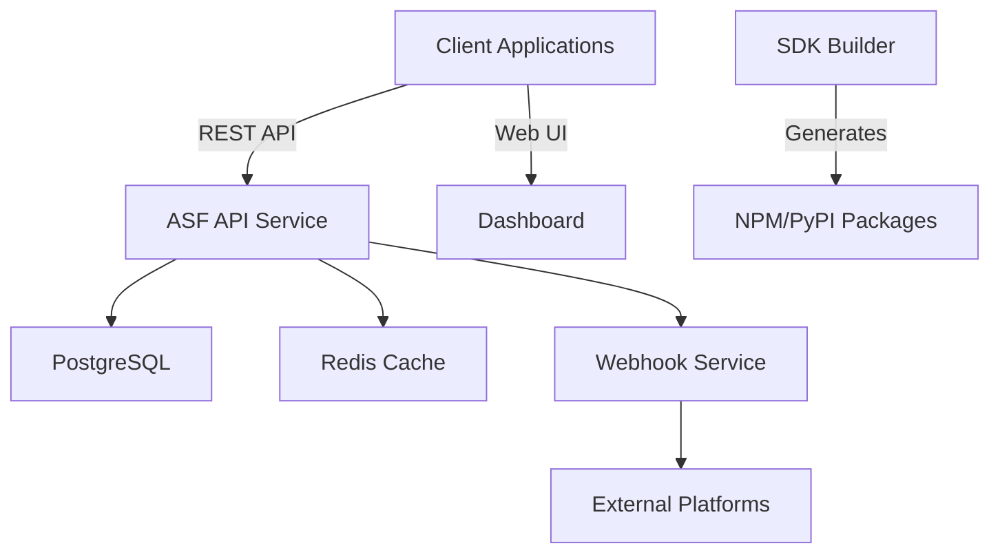

# ASF Platform Integration SDK - Docker Deployment

## Overview

This Docker deployment provides a complete containerized environment for the Agent Saturday Framework (ASF) Platform Integration SDK. It includes:

- 🚀 **API Service** - REST endpoints for agent verification
- 📊 **Dashboard** - Web interface for monitoring and management
- 🗄️ **PostgreSQL Database** - Persistent storage for agent data
- ⚡ **Redis Cache** - High-performance caching and rate limiting
- 🔔 **Webhook Service** - Real-time event notifications
- 📦 **SDK Builder** - Multi-language SDK compilation environment

## Quick Start

### Prerequisites
- Docker 20.10+
- Docker Compose 2.0+
- 4GB RAM minimum
- 10GB disk space

### Initial Setup

```bash
# 1. Clone and navigate to the directory
cd ASF-15-docker

# 2. Initialize environment
make init
# Edit .env file with your configuration

# 3. Build and start services
make build
make up

# 4. Check service status
make status
```

### Accessing Services

- **API**: http://localhost:8080
- **API Documentation**: http://localhost:8080/docs
- **Dashboard**: http://localhost:3000
- **Health Check**: http://localhost:8080/health

## Architecture



## Service Configuration

### API Service (Port 8080)
- Node.js 20 Alpine-based
- Express.js REST framework
- JWT authentication
- Rate limiting via Redis
- Health checks enabled

### Dashboard (Port 3000)
- React-based SPA
- Nginx serving static files
- Real-time metrics display
- API key management UI

### Database (Port 5432)
- PostgreSQL 15 Alpine
- Persistent volume storage
- Automated backups
- Migration support

### Redis (Port 6379)
- Redis 7 Alpine
- AOF persistence enabled
- Used for caching & rate limiting

## Development

### Running in Development Mode

```bash
# Start with hot reload
make dev

# View logs
make logs

# View specific service logs
make logs-api
make logs-dashboard
```

### Building SDKs

```bash
# Build all SDK packages
make build-sdks

# Output will be in ./build-artifacts/
```

### Running Tests

```bash
# Run all tests
make test

# Run specific service tests
docker-compose run --rm api npm test
```

## Production Deployment

### Pre-deployment Checklist

- [ ] Update `.env` with production values
- [ ] Change default passwords and secrets
- [ ] Enable SSL/TLS termination
- [ ] Configure backup strategy
- [ ] Set up monitoring alerts

### Deployment

```bash
# Run production deployment
make deploy

# This will:
# 1. Run integration tests
# 2. Backup database
# 3. Build new images
# 4. Deploy with zero downtime
```

### Scaling

```bash
# Scale API service
docker-compose up -d --scale asf-api=3

# Scale webhook service
docker-compose up -d --scale webhook-service=2
```

## Monitoring

### Health Endpoints

- API Health: `GET /health`
- Dashboard Health: `GET /`
- Webhook Health: `GET /health`

### Metrics

Prometheus metrics available at:
- API: `http://localhost:8080/metrics`
- Format: OpenMetrics/Prometheus

### Logging

All services output JSON-formatted logs:

```bash
# View all logs
docker-compose logs -f

# Export logs
docker-compose logs > asf-logs.txt
```

## Backup & Recovery

### Automated Backups

```bash
# Create backup
make backup

# Backups stored in ./backups/
# Keeps last 7 backups
```

### Manual Recovery

```bash
# Restore from backup
docker-compose exec -T postgres psql -U asf asf_db < backups/asf_backup_20240213_120000.sql
```

## Security

### Best Practices

1. **Secrets Management**
   - Use environment variables for secrets
   - Rotate JWT secrets regularly
   - Use strong database passwords

2. **Network Security**
   - Services communicate on internal network
   - Only necessary ports exposed
   - Use reverse proxy for production

3. **Container Security**
   - Non-root users in containers
   - Minimal base images (Alpine)
   - Regular security updates

## Troubleshooting

### Common Issues

**Services won't start**
```bash
# Check logs
make logs

# Reset everything
make clean
make build
make up
```

**Database connection errors**
```bash
# Check database is running
docker-compose ps postgres

# Test connection
docker-compose exec postgres psql -U asf -d asf_db
```

**Port conflicts**
```bash
# Change ports in docker-compose.yml
# Or stop conflicting services
```

### Debug Mode

```bash
# Enable debug logging
export LOG_LEVEL=debug
docker-compose up
```

## Maintenance

### Updates

```bash
# Pull latest changes
git pull

# Rebuild and restart
make restart
```

### Cleanup

```bash
# Remove stopped containers
docker-compose down

# Remove everything including data
make clean
```

## Support

- **Documentation**: See `/docs` directory
- **API Reference**: http://localhost:8080/docs
- **Issues**: Create ticket in ASF JIRA

---

Built with ❤️ by the ASF Deploy Agent ⚙️