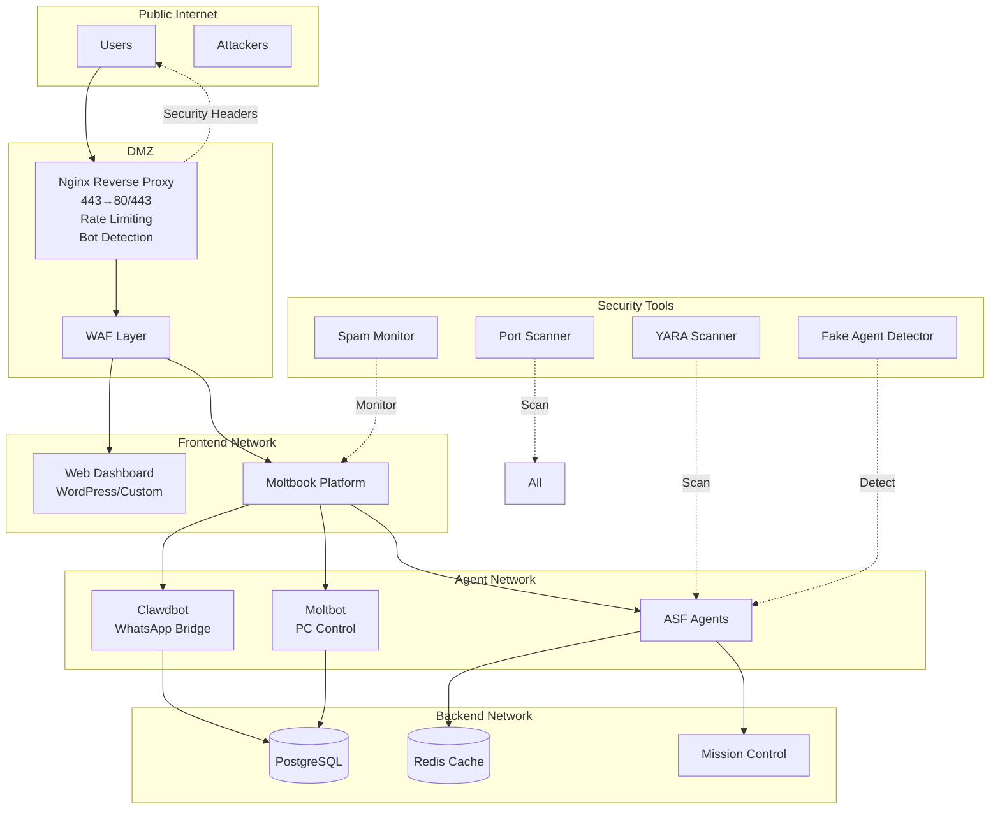

# ASF Checklist for Clawdbot-Moltbot-Open-Claw

## Quick Start: Secure Your Stack in 5 Minutes

```bash
# 1. Clone the repo
git clone https://github.com/jeffvsutherland/agent-security-framework.git
cd agent-security-framework

# 2. Run quick setup
./deployment-guide/asf-quick-setup.sh

# 3. Secure deploy
./openclaw-secure-deploy.sh
```

## Component Mapping

### Moltbook (Core Platform)
| Component | ASF Story/Tool | Status | Next Action |
|-----------|----------------|--------|--------------|
| Container | ASF-2 Docker | ✅ Deployed | Verify hardening |
| Spam monitoring | ASF-22 | 📋 In Progress | Tune thresholds, add webhook |
| Bad actor DB | ASF-24 | ✅ Running | Monitor alerts |
| Content scanning | ASF-5 YARA | 📋 Pending | Create rules |

### Clawdbot (WhatsApp Bridge)
| Component | ASF Story/Tool | Status | Next Action |
|-----------|----------------|--------|--------------|
| Docker container | ASF-2 Docker | ✅ Deployed | Verify hardening |
| API keys | Secrets mgmt | 📋 Pending | Set up Vault |
| Network isolation | port-scan-detector | ✅ Running | Review scans |
| Fake agent detection | fake-agent-detector | ✅ Running | Daily scan cron |

### Moltbot (PC Control)
| Component | ASF Story/Tool | Status | Next Action |
|-----------|----------------|--------|--------------|
| Voice stack | ASF-2 Docker | ✅ Deployed | Verify hardening |
| Discord/Telegram | infrastructure-check | ✅ Running | Review logs |
| Unauthorized exec | fake-agent-detector | ✅ Running | Daily scan |
| Privilege escalation | ASF-18 Code Review | ✅ Done | Continue process |

### Open-Claw (Host)
| Component | ASF Story/Tool | Status | Next Action |
|-----------|----------------|--------|--------------|
| Docker hardening | ASF-2 | ✅ Deployed | Verify hardening |
| Network isolation | ASF-4 | ✅ Configured | Test failover |
| Config drift | asf-quick-setup | ✅ Running | Daily check |
| Credential theft | ASF-5 | 📋 Pending | Add YARA rules |

## Deployment Order

### Phase 1: Foundation (Day 1) ✅
1. ✅ ASF-2: Docker templates deployed
2. ✅ ASF-4: Quick setup tested
3. ✅ ASF-18: Code review process in place
4. ✅ ASF-21: Bad actor DB

### Phase 2: Protection (Day 2) 🔄
1. 📋 ASF-22: Tune thresholds, add webhook alerts
2. 📋 ASF-5: Implement YARA rules
3. ✅ ASF-24: Bad actor database running
4. 🔄 ASF-26: Deploy nginx with security headers

### Phase 3: Hardening (Day 3)
1. 📋 ASF-26: Full website security
2. 📋 ASF-20: Enterprise integration
3. 🔄 Testing & validation

## Reference Architecture



## Security Checklist

### Pre-Deploy
- [ ] GitHub tokens rotated
- [ ] Docker secrets configured
- [ ] Network isolation verified
- [ ] Backup tested

### Post-Deploy
- [ ] All services healthy
- [ ] Logging to central system
- [ ] Alerts configured
- [ ] Run asf-openclaw-scanner.py

### Daily Operations
- [ ] Hourly security check (via ASF-18)
- [ ] YARA scan of new skills
- [ ] Review spam reports
- [ ] Check infrastructure logs

### Weekly
- [ ] Update Docker images
- [ ] Rotate credentials
- [ ] Review false positives
- [ ] Update YARA rules

## One-Command Operations

### Full Security Scan
```bash
./security-tools/infrastructure-security-check.sh
```

### YARA Scan
```bash
yara -r docs/asf-5-yara-rules/*.yar ~/.asf/skills/
```

### Spam Detection
```bash
./security-tools/moltbook-spam-monitor.sh
```

### Agent Health
```bash
python3 deployment-guide/asf-openclaw-scanner.py
```

## Test & Validation Steps

### Test Spam Detection
1. Post test spam content
2. Verify alert received
3. Check blocklist updated

### Test Website Security
1. Run OWASP ZAP scan
2. Verify headers present
3. Test rate limiting

### Test Agent Detection
1. Run fake-agent-detector.sh
2. Verify detection works
3. Check quarantine process

## Emergency Response

### If Compromised
1. Isolate container: `docker network disconnect`
2. Preserve evidence: `cp -r ~/.asf ~/asf-backup-$(date)`
3. Rotate all credentials
4. Review logs: `~/asf-backup-*/logs/`
5. Notify via configured webhooks

### Contact
- Security issues: See RESPONSIBLE_DISCLOSURE.md
- Enterprise support: ASF-20 integration docs

## Related Documentation

| Document | Purpose |
|----------|---------|
| ASF-SCRUM-PROTOCOL.md | Team process |
| deployment-guide/README.md | Deployment |
| ASF-18-SCRUM-PROCESS.md | Code review |
| ASF-ENTERPRISE-INTEGRATION-GUIDE.md | Enterprise |
| docs/asf-22-spam-monitoring/README.md | Spam monitoring |
| docs/asf-26-website/README.md | Website security |

---
**Last Updated:** February 2026
**Version:** 1.1.0
