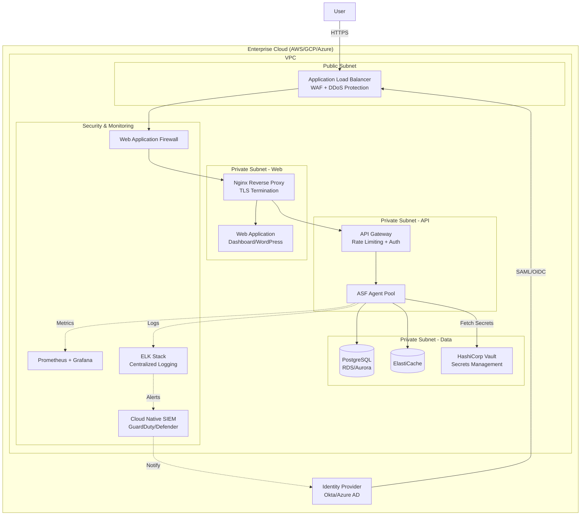

# ASF-20: Enterprise Integration

## Reference Architecture



## Sidecar Patterns

### Vault Sidecar for Secrets
```yaml
# Inject secrets from Vault into containers
vault:
  image: hashicorp/vault-sidecar:latest
  security_opt:
    - no-new-privileges:true
  cap_drop:
    - ALL
  volumes:
    - /var/run/docker.sock:/var/run/docker.sock:ro
  environment:
    - VAULT_ADDR=https://vault.company.com
    - VAULT_ROLE=asf-agent
```

### Prometheus Metrics Sidecar
```yaml
metrics:
  image: asf/metrics-exporter:latest
  ports:
    - "9090:9090"
  environment:
    - METRICS_INTERVAL=60
```

### Fluentd Logging Forwarder
```yaml
logging:
  image: fluent/fluentd:v1.16
  volumes:
    - /var/log:/var/log
    - ./fluent.conf:/etc/fluent/fluent.conf
  environment:
    - FLUENTD_HOST=elasticsearch.company.com
    - FLUENTD_PORT=24224
```

## Deployment Patterns

## Overview

Enterprise integration package for large organizations.

## Core Components

- SSO/SAML/OIDC
- RBAC + Secrets Management
- Centralized Logging (ELK/Splunk)
- Metrics (Prometheus/Grafana)
- Compliance/Audit
- Kubernetes Ready

## Deliverables

| File | Description |
|------|-------------|
| ASF-ENTERPRISE-INTEGRATION-GUIDE.md | Primary guide |
| ASF-ENTERPRISE-API-ENDPOINTS.md | API definitions |
| ASF-ENTERPRISE-PRICING-LICENSING.md | Commercial model |

## Reference Architectures

- AWS EKS
- On-Premises (Docker/K8s)

## References

- ASF-17-REST-API.md
- docker-templates/
